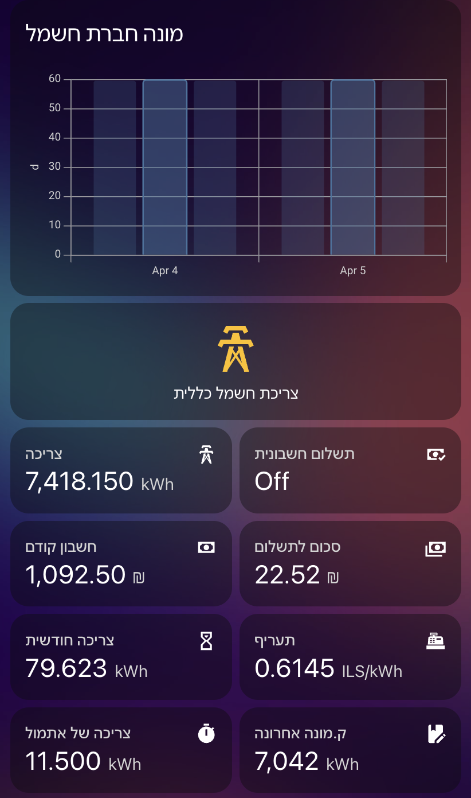

# Few examples of cards/dashboards using the component


### Is paid invoice (by Noam Shaharabani)


```
type: custom:vertical-stack-in-card
cards:
- type: custom:button-card
  entity: binary_sensor.is_last_iec_invoice_paid
  show_state: false
  show_icon: false
  state:
    - value: 'off'
      name: החשבונית האחרונה עדיין לא שולמה
      styles:
        card:
          - color: white
          - background: '#FF8080'
    - value: 'on'
      name: החשבונית האחרונה שולמה
      styles:
        card:
          - color: black
          - background: '#CDFAD5'
  styles:
    card:
    - border: 0px
    - height: 0px
    - margin-top: null
    - type: horizontal-stack
  cards:
- type: horizontal-stack
  cards:
  - type: custom:button-card
    entity: sensor.last_iec_bill_electric_cost
    show_state: true
    show_name: true
    name: לתשלום
    show_icon: true
    icon: mdi:currency-ils
    styles:
      card:
        - border: 0px
        - padding-top: 15px
      name:
        - font-size: 14px
      state:
        - font-size: 15px
  - type: custom:button-card
    entity: sensor.last_iec_bill_length_in_days
    show_state: false
    show_name: true
    name: לתקופה של
    show_icon: true
    icon: mdi:sun-angle
    show_label: true
    label: |
      [[[
      return entity.state + ' ימים';
      ]]]
    styles:
      card:
        - border: 0px
        - padding-top: 15px
      name:
        - font-size: 14px
      label:
        - font-size: 15px
  - type: custom:button-card
    entity: sensor.last_iec_bill_payment_date
    show_state: true
    show_name: true
    name: לתשלום עד
    show_icon: true
    icon: mdi:calendar
    styles:
      card:
        - border: 0px
        - padding-bottom: 15px
        - padding-top: 15px
      name:
        - font-size: 14px
      state:
        - font-size: 15px
  - type: custom:button-card
    entity: sensor.last_iec_bill_electric_usage_to_date
    show_state: true
    show_name: true
    name: קילוואט
    show_icon: true
    icon: mdi:lightning-bolt
    styles:
      card:
        - border: 0px
        - padding-bottom: 15px
        - padding-top: 15px
      name:
        - font-size: 14px
      state:
        - font-size: 15px
      
```


### Energy Summary (by Moshiko Peer)

(requires to create a helper `input.is_power` entity)
```
type: vertical-stack
cards:
  - chart_type: bar
    period: day
    type: statistics-graph
    entities:
      - sensor.last_iec_bill_length_in_days
    days_to_show: 2
    stat_types:
      - min
      - mean
      - max
    title: מונה חברת חשמל
    hide_legend: true
  - show_name: true
    show_icon: true
    type: button
    tap_action:
      action: toggle
    entity: input_boolean.power
    name: צריכת חשמל כללית
    icon_height: 60px
  - type: conditional
    conditions:
      - entity: input_boolean.power
        state: 'on'
    card:
      square: false
      type: grid
      cards:
        - square: false
          type: grid
          cards:
            - type: entity
              entity: sensor.iec_latest_meter_reading
              icon: mdi:transmission-tower
              name: צריכה
              state_color: true
            - type: entity
              entity: binary_sensor.iec_contract_347910537_meter_23511627_is_last_iec_invoice_paid
              name: תשלום חשבונית
              icon: mdi:cash-check
            - type: entity
              entity: sensor.last_iec_bill_amount_to_pay
              name: חשבון קודם 
              icon: mdi:cash
            - type: entity
              entity: sensor.next_bill_electric_forecasted_cost
              name: סכום לתשלום
              icon: mdi:cash-multiple
          columns: 2
        - type: grid
          cards:
            - type: entity
              entity: sensor.iec_this_month_electric_consumption
              name: צריכה חודשית
              icon: mdi:timer-sand
              state_color: true
            - type: entity
              entity: sensor.iec_kwh_tariff
              name: תעריף
              icon: mdi:cash-register
          columns: 2
          square: false
        - type: grid
          cards:
            - type: entity
              entity: sensor.iec_yesterday_electric_consumption
              name: צריכה של אתמול
              icon: mdi:timer
            - type: entity
              entity: sensor.last_iec_bill_meter_reading
              name: ק.מונה אחרונה
              icon: mdi:book-edit
          columns: 2
          square: false
      columns: 1
```

### Summary (by Noy (Petel))


(requires using *Sections* dashboard)
```
    sections:
      - type: grid
        cards:
          - type: tile
            entity: sensor.iec_kwh_tariff
            color: green
            vertical: true
            name: null
          - type: tile
            entity: sensor.last_iec_bill_date
            color: green
            vertical: true
            name: תאריך חשבונית אחרונה
          - type: gauge
            entity: >-
              sensor.iec_contract_123_meter_456_next_bill_electric_forecasted_cost
            min: 0
            needle: true
            severity:
              green: 0
              yellow: 1100
              red: 1500
            max: 2200
          - type: gauge
            entity: sensor.last_iec_bill_electric_cost
            min: 0
            needle: true
            severity:
              green: 0
              yellow: 1100
              red: 1500
            max: 2200
          - type: entities
            entities:
              - entity: sensor.last_iec_bill_length_in_days
              - entity: >-
                  sensor.iec_contract_123_meter_456_iec_today_electric_consumption
              - entity: >-
                  sensor.iec_contract_123_meter_456_iec_yesterday_electric_consumption
              - entity: >-
                  sensor.iec_contract_123_meter_456_iec_this_month_electric_consumption
              - entity: sensor.last_iec_bill_electric_usage_to_date
              - entity: >-
                  sensor.iec_contract_123_meter_456_iec_latest_meter_reading
              - entity: >-
                  sensor.iec_contract_123_meter_456_iec_latest_meter_reading
              - entity: >-
                  sensor.iec_contract_123_meter_456_next_bill_electric_forecasted_usage
              - entity: sensor.last_iec_bill_payment_date
        title: 'נתונים מחברת חשמל'
```
